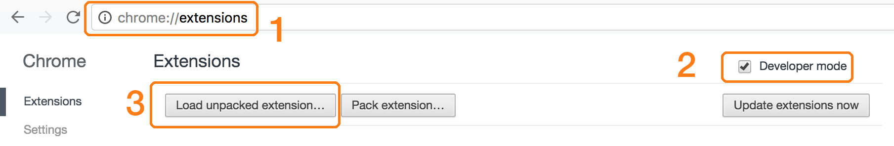

# chrome-coffeescript v0.0.1

Write and run `coffeescript` inside your Chrome browser.

# install

**1.** Goto `chrome://extensions`

**2.** Enable `Developer Mode`

**3.** Select the `src` directory as the "unpacked extension"

# features

- Syntax highlighting provided via the [ACE editor](http://ace.ajax.org)
- [CoffeeScript](https://github.com/jashkenas/coffee-script) compilation
- `⌘+return` or `shift+return` to run the current script

